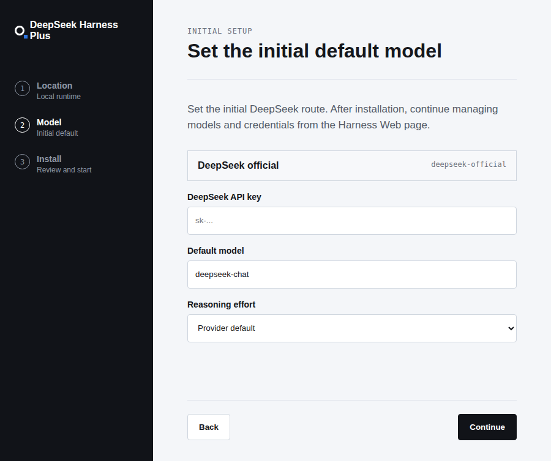

# Plus Tray Manager

Status: in development

[中文](INSTALLER.zh.md)

## User goal

You use DeepSeek Harness through its Web page. The desktop application provides a one-time initial setup guide, then stays in the system tray so you can manage the local runtime without returning to a terminal.

## Initial setup

Before the local service exists, the installer guide asks for an empty installation folder, local port, DeepSeek API key, default model, and optional reasoning effort. It clones and builds Plus, writes those initial values into its isolated DSH_HOME, starts the service, opens the browser page, and closes the guide.

The guide is not a second settings center. After installation, the Web page owns model changes, credentials, presets, workspace choices, and every agent interaction. The tray manager has no menu item for those settings and does not read credential files after the initial install. Once the checkout is cloned, a later dependency or build failure leaves the tray repair action available instead of claiming installation completed.

## Tray actions

- Install Plus: open the initial guide when no local runtime exists.
- Start service: launch the configured local Web service and wait until it reports its listening URL.
- Stop service: end the local Web service while leaving its state intact.
- Open DeepSeek Harness: open the configured local URL in your browser.
- Upgrade Plus: fast-forward the checkout, restore locked dependencies, build it, and restart it when it was running.
- Repair installation: restore locked dependencies and rebuild the configured checkout.

The source-build installer requires Git and pnpm on the local machine. It checks both before cloning any repository and reports a missing tool in the installer guide.

## Platforms

Release targets are macOS DMG, Linux AppImage and deb, and Windows NSIS. The same guide and tray source runs on all three platforms. Each installer target must be built and verified on its matching runner before a release is published.

## Current release status

The initial guide, tray manager source, and Linux AppImage/deb artifacts are implemented locally. No downloadable installer or Plus release is available yet. Windows and macOS artifacts, native desktop verification, and human PR approval are required before release.
