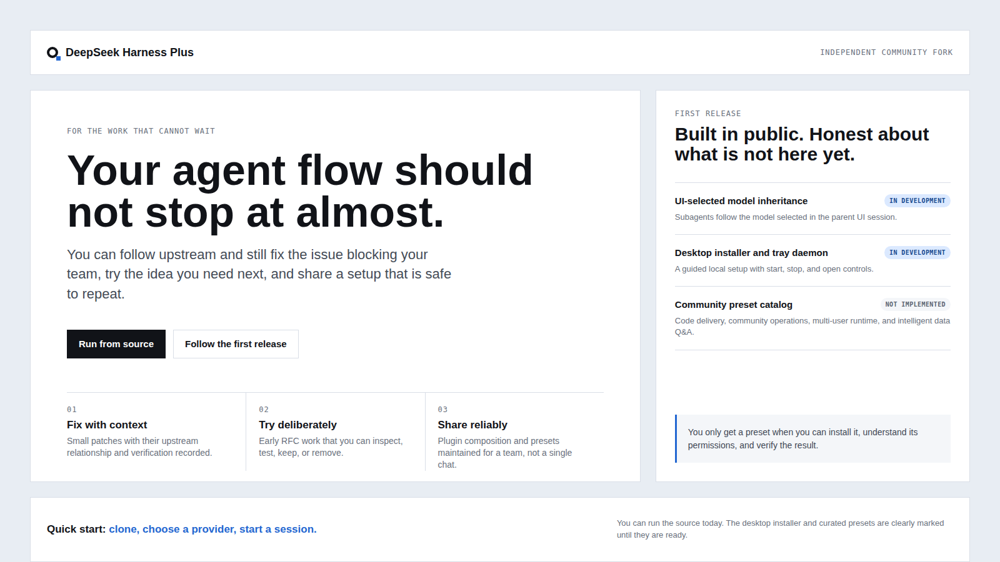

# DeepSeek Harness Plus

[中文](README.zh.md) · [What is planned](PRESETS.md) · [Contributing](CONTRIBUTING.md)

<p align="center">
  <strong>You should not have to wait on somebody else to fix the last thing blocking your agent.</strong><br>
  <em>Patch the sharp edge. Try the next idea. Keep your work moving.</em>
</p>

<p align="center">
  <a href="#run"></a>
  <a href="#not-shipped-yet"></a>
</p>

[](https://github.com/deepseek-ai/deepseek-harness) [](LICENSE) [](https://github.com/SparkElf/deepseek-harness-plus/discussions)

<p align="center">
  
</p>

You already have DeepSeek Harness doing useful work. Then you find the bug that breaks your flow, the RFC you want to try before it lands, or the plugin combination you cannot safely hand to the rest of your team. DeepSeek Harness Plus gives you a place to solve that problem in the open.

You keep the upstream plugin architecture. You get focused fixes you can review, experiments you can turn on deliberately, and a growing path toward presets your team can install instead of rebuilding from chat fragments. Plus is an independent community fork of [DeepSeek Harness](https://github.com/deepseek-ai/deepseek-harness).

<a id="run"></a>

## 🚀 Quick start

<a id="run-from-source"></a>

### Run it in three steps

1. Clone the repository and install the locked dependencies.
2. Build the source and start the local Web UI.
3. Open the UI, choose your model provider, and start a session.

You need Node.js 22.19+ or 24+, Corepack, and pnpm.

```sh
git clone https://github.com/SparkElf/deepseek-harness-plus.git
cd deepseek-harness-plus
corepack enable
pnpm install
pnpm run build
pnpm dsh web
```

Open `http://127.0.0.1:3080`. Your credentials stay in local configuration, never in Git.

## 💡 This helps you when...

| You are trying to... | You need... |
| --- | --- |
| Get past a bug that stops real work | A small patch with a clear scope, evidence, and upstream relationship. |
| Try an upstream idea without betting your whole setup on it | A bounded implementation you can inspect, test, keep, or remove. |
| Share a plugin stack with a team | A maintained composition around routes, tools, settings, permissions, and UI contributions. |
| Stop recreating the same setup from old conversations | A versioned preset with installation, credential, permission, and verification guidance. |

## 📦 What you can use today

- You can run the full upstream Harness source and Web UI from this repository.
- You can follow the upstream through the maintained `upstream` remote.
- You can open Issues, start Discussions, send pull requests, and report security problems privately.
- You can propose patches, plugins, presets, and deployment work in a repository built to review them.

<a id="not-shipped-yet"></a>

## 🧭 Not shipped yet

Do not install or depend on these yet. They are the work you can watch and help shape:

| Planned work | Status |
| --- | --- |
| Subagents follow the model you selected in the UI | In development |
| Desktop installer and tray-managed local daemon | In development |
| Code delivery preset | Not implemented |
| Community operations preset | Not implemented |
| Multi-user runtime preset | Not implemented |
| Intelligent data Q&A preset | Not implemented |

You can read the release conditions in [PRESETS.md](PRESETS.md). A preset is not called available until you can run it, understand its permissions, install it, and verify it.

## ❓ Quick answers

**Is this an official DeepSeek project?** No. You are using an independent community fork that follows the upstream source and license.

**Can you use it today?** Yes, from source. The desktop installer is still in development, so there is no packaged installer to download yet.

**Can you install a preset today?** No. Code delivery, community operations, multi-user runtime, and intelligent data Q&A are all explicitly not implemented yet.

**Can you expose this directly to the public internet for a team?** No. The multi-user deployment preset is not available. Keep your local Harness runtime private.

**Will your local changes disappear during an upstream sync?** They should not be mysterious. Supported changes are recorded with their purpose, affected files, and verification path before they become part of Plus.

## 🤝 Help make it useful

If you hit a failure that costs you time, open an Issue. If your team repeats a workflow, start a Discussion. If you have a focused improvement with proof behind it, send a pull request.

You are welcome to contribute bug fixes, early RFC implementations, community plugins, presets, deployment assets, documentation, and review. Read [CONTRIBUTING.md](CONTRIBUTING.md) first. Report security issues through [SECURITY.md](SECURITY.md), not a public issue.

## 🔄 Stay close to upstream

```sh
git fetch upstream
git merge upstream/master
```

You should always be able to see why this fork differs. Every supported divergence records what changed, why it exists, what it touches, and how you can verify it.

## License

You can use DeepSeek Harness Plus under the upstream [MIT License](LICENSE). Third-party notices are listed in [THIRD_PARTY_NOTICES.md](THIRD_PARTY_NOTICES.md). This is an independent community project and is not affiliated with or endorsed by DeepSeek.
