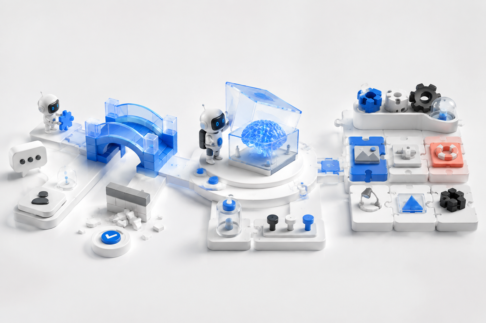

# DeepSeek Harness Plus

[中文](README.zh.md) · [What is planned](PRESETS.md) · [Contributing](CONTRIBUTING.md)

<p align="center">
  <strong>Fix the blocker. Try the next feature. Make Harness fit the work in front of you. ✨</strong><br>
  <em>DeepSeek Harness Plus brings useful community improvements to your hands sooner.</em>
</p>

<p align="center">
  <a href="#run"></a>
  <a href="#not-shipped-yet"></a>
</p>

[](https://github.com/deepseek-ai/deepseek-harness) [](LICENSE) [](https://github.com/SparkElf/deepseek-harness-plus/discussions)

<p align="center">
  
</p>

> 💡 **The short version:** get unstuck sooner, try the next capability early, and use a setup that matches the job instead of rebuilding one from zero.

## ✨ What Plus does for you

Harness is already doing useful work, until one last thing gets in the way. Maybe a bug blocks a real task. Maybe the feature you want is still being discussed upstream. Maybe your team is tired of rebuilding the same blank setup. That is when Plus is here for you.

### 🚑 Fix blockers sooner

A session, model, or tool problem should not put your work on pause. When DeepSeek has not released the fix yet, Plus can bring you a focused repair first, with the change and its verification kept clear.

### 🧪 Try new features early

Do not wait for a promising idea to become old news. When an upstream capability is still under RFC discussion, Plus can offer it as an optional experimental feature for your real workflow. Try it, keep it when it helps, and leave it behind when it does not.

### 🧩 Use extensions and themed presets

Plus is where community plugins and user-facing extensions show up for real work. A preset is a versioned collection of Harness plugins and the configuration they need, ready to choose instead of manually assemble.

Intelligent data Q&A, multi-user runtime, code development, AIGC, and community operations are planned themes. They are not current downloads: a preset only becomes available when its plugins, configuration, permissions, and verification instructions arrive together.

## 🛡️ Why you can trust Plus

Plus stays close to [DeepSeek Harness](https://github.com/deepseek-ai/deepseek-harness), so you can tell where an improvement came from, what it changes for your work, and how it was checked. You get the extra capability without turning your Harness environment into a mysterious pile of patches.

<a id="run"></a>

## 🚀 Run from source today

<a id="run-from-source"></a>

### Run it in three steps

1. Clone the repository and install the locked dependencies.
2. Build the source and start the local Web UI.
3. Open the UI, choose your model provider, and start a session.

You need Node.js 22.19+ or 24+, Corepack, and pnpm.

```sh
git clone https://github.com/SparkElf/deepseek-harness-plus.git
cd deepseek-harness-plus
corepack enable
pnpm install
pnpm run build
pnpm dsh web
```

Open `http://127.0.0.1:3080`. Your credentials stay in local configuration, never in Git.

## ✅ What you can use today

- You can run the full upstream Harness source and Web UI from this repository.
- You can follow the upstream through the maintained `upstream` remote.
- You can use the subagent model-inheritance repair in the Plus source branch, with focused regression coverage.
- You can report a blocker, propose an experimental feature, or contribute an extension, preset, documentation, or deployment improvement in the open.

<a id="not-shipped-yet"></a>

## 🛠️ What is still being built

Do not depend on the following until a release marks them available:

| Capability | Status |
| --- | --- |
| Fast fixes and early experimental features | Ongoing community work; each item needs its own evidence before use |
| Desktop setup guide and tray-managed local runtime | Linux/Windows 0.1.0 packages are available on [Releases](https://github.com/SparkElf/deepseek-harness-plus/releases/tag/plus-v0.1.0); macOS is deferred pending signing and notarization |
| Code development preset | Not implemented |
| Intelligent data Q&A preset | Not implemented |
| Multi-user runtime preset | Not implemented |
| AIGC preset | Not implemented |
| Community operations preset | Not implemented |

Read [PRESETS.md](PRESETS.md) for the preset release rule. Keep a local runtime private: no multi-user or public-internet deployment preset is available yet.

## 💬 Quick answers

**Is this an official DeepSeek project?** No. It is an independent community project that tracks the upstream source and follows its license.

**Why not wait for the official release?** You may choose a Plus repair or experimental feature when it solves an immediate need. Plus keeps the difference explicit, reviewed, and verifiable instead of hiding it in a private patch.

**Can you install a preset today?** No. A theme is only called a preset when its plugins and configuration install together, permissions are clear, and the result has verification evidence.

**Can you download the desktop installer today?** Yes. [Plus 0.1.0](https://github.com/SparkElf/deepseek-harness-plus/releases/tag/plus-v0.1.0) includes Linux AppImage/deb and a Windows NSIS installer. macOS is deferred until signing and notarization are configured.

**Can you expose this directly to the public internet for a team?** No. The multi-user runtime preset is not available. Keep your current Harness runtime private.

**Will your local changes disappear during an upstream sync?** They should not be mysterious. Supported changes are recorded with their purpose, affected files, and verification path before they become part of Plus.

## 🤝 Help shape Plus

If you hit a failure that costs you time, open an Issue. If your team repeats a workflow, start a Discussion. If you have a focused improvement with proof behind it, send a pull request.

You are welcome to contribute bug fixes, early RFC implementations, community plugins, presets, deployment assets, documentation, and review. Read [CONTRIBUTING.md](CONTRIBUTING.md) first. Report security issues through [SECURITY.md](SECURITY.md), not a public issue.

## 🔄 Stay close to upstream

```sh
git fetch upstream
git merge upstream/master
```

You should always be able to see why Plus differs from upstream. Every supported community difference records what changed, why it exists, what it touches, and how you can verify it.

## License

You can use DeepSeek Harness Plus under the upstream [MIT License](LICENSE). Third-party notices are listed in [THIRD_PARTY_NOTICES.md](THIRD_PARTY_NOTICES.md). This is an independent community project and is not affiliated with or endorsed by DeepSeek.
