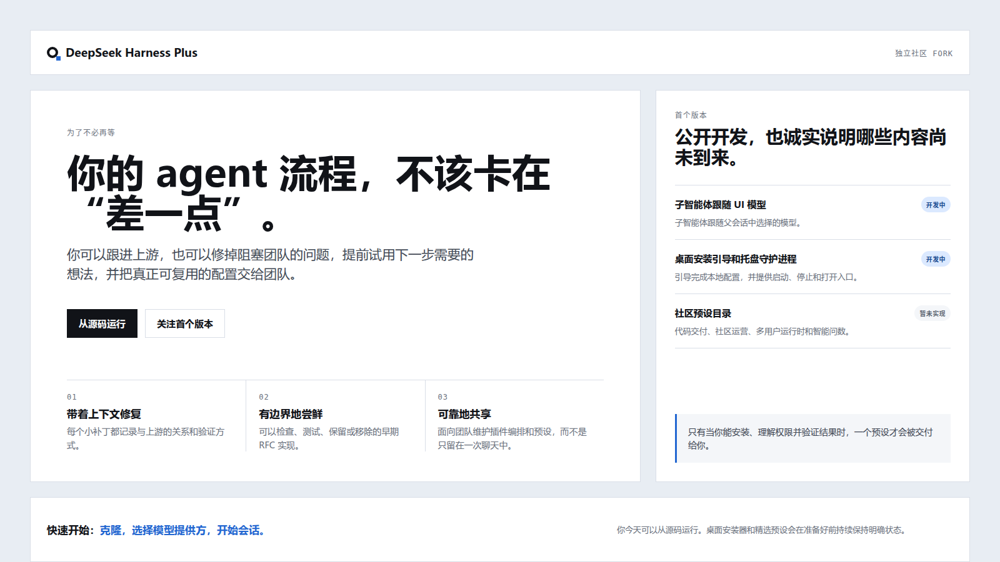

# DeepSeek Harness Plus

[English](README.md) · [规划中的内容](PRESETS.md) · [参与贡献](CONTRIBUTING.md)

<p align="center">
  <strong>不必为了一个卡住 agent 的问题，站在原地等上游。</strong><br>
  <em>把眼前的问题修好，把值得尝鲜的功能跑起来，让工作继续往前走。</em>
</p>

<p align="center">
  <a href="#run"></a>
  <a href="#not-shipped-yet"></a>
</p>

[](https://github.com/deepseek-ai/deepseek-harness) [](LICENSE) [](https://github.com/SparkElf/deepseek-harness-plus/discussions)

<p align="center">
  
</p>

你会来到这里，通常不是因为 DeepSeek Harness 完全不能用。恰恰相反，它已经帮你完成了大部分工作，只是关键时刻碰上了一个卡住流程的问题，或者你想提前试试上游正在讨论的功能，又或者一组插件还不敢直接交给整个团队使用。

这时你需要的不是再等一次回复，也不是从聊天记录里东拼西凑配置。DeepSeek Harness Plus 是 [DeepSeek Harness](https://github.com/deepseek-ai/deepseek-harness) 的独立社区 fork。这里会持续跟进上游，把值得解决的问题、值得提前验证的实验性功能，以及适合团队复用的插件组合，做成能看懂、能审查、能验证的改动。预设会把插件和相关配置一起装好，你选中后直接使用，不必再逐个拼装。

<a id="run"></a>

## 🚀 快速上手

<a id="run-from-source"></a>

### 三步跑起来

1. 克隆仓库并安装锁定版本的依赖。
2. 构建源码，启动本地 Web UI。
3. 打开页面，配置模型提供方，开始第一个会话。

你需要 Node.js 22.19+ 或 24+、Corepack 和 pnpm。

```sh
git clone https://github.com/SparkElf/deepseek-harness-plus.git
cd deepseek-harness-plus
corepack enable
pnpm install
pnpm run build
pnpm dsh web
```

浏览器打开 `http://127.0.0.1:3080` 即可。模型凭据保存在本地配置里，不要提交到 Git。

## 💡 什么时候你会需要 Plus

| 你遇到的情况 | Plus 要解决的事 |
| --- | --- |
| 一个缺陷已经影响了真实工作 | 提供范围清楚、能追溯上游关系、带验证证据的补丁。 |
| 你想提前验证一个上游方向 | 提供边界明确的实验性功能，你可以自己判断要不要继续使用。 |
| 你要把插件组合交给团队 | 维护路由、工具、配置、权限和 UI 扩展之间的编排关系。 |
| 你不想每次都从旧聊天记录里重建环境 | 一套插件和相关配置都已经配好的预设，安装后直接使用。 |

## 📦 现在可以用什么

- 可以直接运行完整的上游 Harness 源码和 Web UI。
- 可以通过维护中的 `upstream` remote 持续跟进上游。
- 可以提交 Issue、发起 Discussion、提交 Pull Request，也可以私下报告安全问题。
- 可以提出补丁、社区插件、预设和部署方案，并让它们经过公开审查。

<a id="not-shipped-yet"></a>

## 🧭 还在开发，暂时不要依赖

下面这些是我们正在推进的方向，不包含在当前 checkout 或安装器中：

| 规划工作 | 状态 |
| --- | --- |
| 子智能体跟随你在 UI 中选定的模型 | 开发中 |
| 桌面安装引导和托盘守护进程 | 开发中 |
| 代码交付预设 | 暂未实现 |
| 社区运营预设 | 暂未实现 |
| 多用户运行时预设 | 暂未实现 |
| 智能问数预设 | 暂未实现 |

完整发布条件见 [PRESETS.md](PRESETS.md)。一个预设只有在能把可用的插件组合和相关配置一起装好、权限说得清、结果可验证时，才会被标记为可用。

## ❓ 常见问题

**这是 DeepSeek 官方项目吗？** 不是。你使用的是一个独立维护的社区 fork，它遵循上游的源码和许可证。

**现在能用吗？** 能。从源码运行即可。桌面安装器还在开发，目前没有可下载的安装包。

**现在能安装预设吗？** 不能。代码交付、社区运营、多用户运行时和智能问数都还没有实现，也不会被包装成现成功能。

**能直接部署到公网给团队使用吗？** 不能。多用户部署预设尚未交付。当前应把 Harness runtime 放在私有网络中运行。

**同步上游会不会把本地改动弄丢？** 不应该。准备进入 Plus 的改动会记录目的、影响文件和验证方式，避免留下无法解释的补丁。

## 🤝 一起把它做得更好

一个问题已经浪费了你很多时间，就创建 Issue。团队总在重复同一套流程，就发起 Discussion。你已经有一个经过验证的改动，就提交 Pull Request。

欢迎提交缺陷修复、实验性功能、社区插件、预设、部署资产、文档和评审意见。开始前请阅读 [CONTRIBUTING.md](CONTRIBUTING.md)。安全问题请通过 [SECURITY.md](SECURITY.md) 报告，不要公开提交 Issue。

## 🔄 跟上游保持同步

```sh
git fetch upstream
git merge upstream/master
```

你应该始终能看清这个 fork 和上游之间有什么不同。每一项受支持的差异都会记录改了什么、为什么要改、影响哪些部分，以及如何验证。

## 许可证

DeepSeek Harness Plus 沿用上游 [MIT 许可证](LICENSE)。第三方声明见 [THIRD_PARTY_NOTICES.md](THIRD_PARTY_NOTICES.md)。本项目为独立社区项目，不隶属于 DeepSeek，也未获得 DeepSeek 背书。
